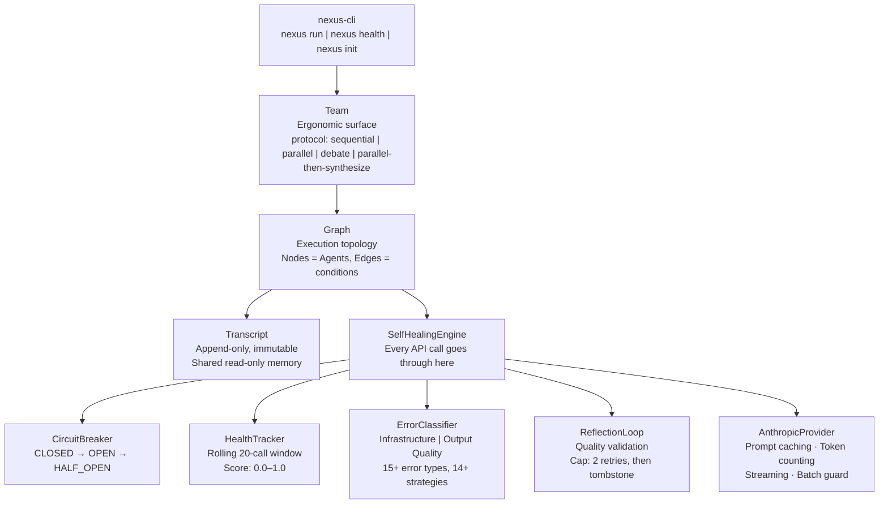
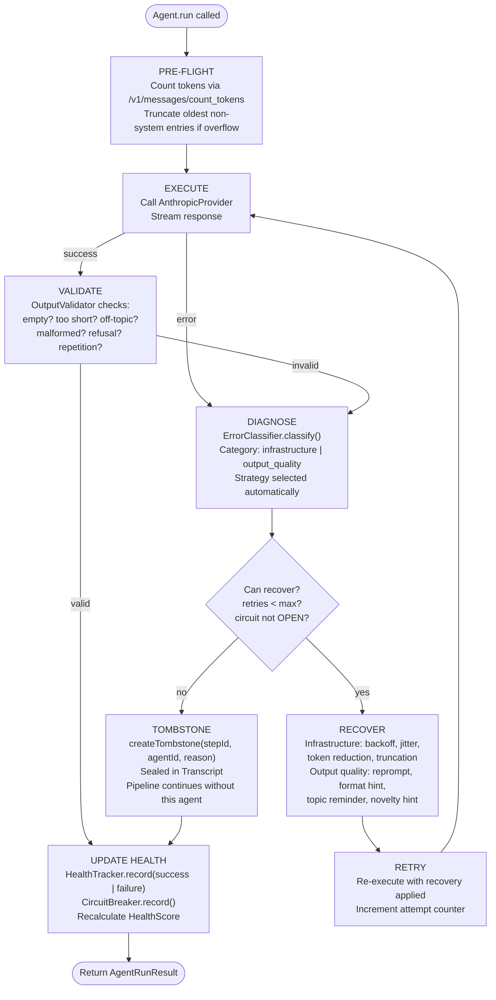
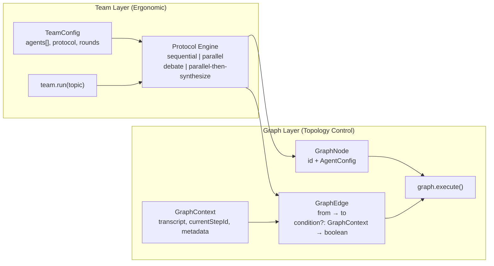
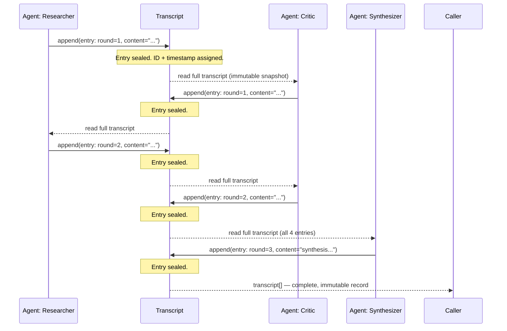
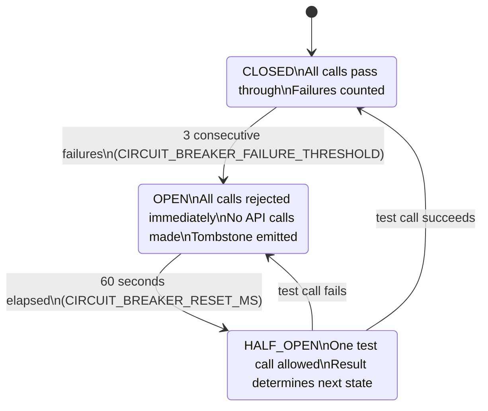

# Architecture

Nexus is a multi-layer system. Each layer has a single job, and they compose cleanly.

---

## Overall Architecture



---

## The Self-Healing Pipeline

Every agent API call — every single one — passes through this pipeline. There is no way to bypass it.



The `AgentRunResult` always comes back — whether the call succeeded, recovered, or tombstoned. The caller always gets a result. The system never hangs silently.

---

## Team + Graph Dual Layer

Nexus exposes two levels of abstraction. Most developers start with `Team`. Some graduate to `Graph`.



**Team** builds the graph for you based on the protocol. You tell it what agents you have and how they should relate. It handles the topology.

**Graph** exposes the underlying execution model directly. Every agent is a `GraphNode`. Every handoff is a `GraphEdge` with an optional condition function. When you need to route based on what a previous agent said — e.g., "only send to the critic if the researcher found conflicting evidence" — you use Graph directly.

The rule: if you can't draw the system as a static diagram before running it, the abstraction has failed you. Graph forces you to draw it.

---

## Transcript Data Flow

The Transcript is the shared memory between agents. It is append-only. No entry is ever modified or deleted after writing.



This design has three consequences that matter:

1. **No silent degradation.** An agent can't overwrite a previous response to hide a failure. The tombstone always shows up in the transcript.

2. **Prompt caching works perfectly.** The system prompt is a stable prefix. The transcript is a growing tail. Anthropic's cache breakpoint sits at the end of the system prompt, and every new round gets more cache hits for free.

3. **Debugging is reading a receipt.** The full transcript is a complete, ordered log of everything that happened. You don't need to reconstruct state.

---

## Circuit Breaker State Machine



When the circuit is OPEN, the agent is bypassed entirely — no API call is made. The `SelfHealingEngine` emits a tombstone with `reason: 'circuit_breaker_open'` and the pipeline continues with the remaining agents.

---

## Health Score Composition

Health is not a single metric. It's a weighted composite of four signals, each measuring a different failure mode.

```
overall = (successRate × 0.30)
        + (latencyScore × 0.15)
        + (qualityScore × 0.30)
        + (recoveryRate × 0.25)
```

| Signal | Weight | What it measures |
|---|---|---|
| `successRate` | 30% | Fraction of calls that succeeded without error |
| `latencyScore` | 15% | How fast responses come back (scored against breakpoints) |
| `qualityScore` | 30% | Output validation pass rate (empty, malformed, off-topic) |
| `recoveryRate` | 25% | When failures happen, how often the agent recovers |

Health states and their thresholds (all named constants in `config/thresholds.ts`):

| State | Threshold | Meaning |
|---|---|---|
| `HEALTHY` | ≥ 0.85 | Normal operation |
| `DEGRADED` | ≥ 0.40 | Elevated failures, circuit breaker watching |
| `RECOVERING` | ≥ 0.15 | Agent has been restored, rebuilding score |
| `FAILED` | < 0.15 | Circuit breaker likely OPEN, tombstones likely present |

All of these are configurable. The values in `thresholds.ts` are calibrated starting points, not magic numbers. Change one constant, it changes everywhere.

---

## Package Structure

```
nexus/
├── packages/
│   ├── nexus-core/          # Framework — Agent, Team, Graph, SelfHealingEngine
│   │   └── src/
│   │       ├── agent/       # Agent class
│   │       ├── team/        # Team class + protocol runners
│   │       ├── graph/       # Graph class + execution engine
│   │       ├── transcript/  # Transcript (append-only)
│   │       ├── healing/     # CircuitBreaker, HealthTracker, ErrorClassifier,
│   │       │                #   ReflectionLoop, OutputValidator, RecoveryStrategies
│   │       ├── provider/    # AnthropicProvider (caching, token counting)
│   │       ├── config/      # thresholds.ts — all named constants
│   │       └── types.ts     # All interfaces, exported
│   └── nexus-agents/        # Pre-built agent personas
├── apps/
│   └── nexus-cli/           # CLI: nexus run | nexus health | nexus init
├── examples/
│   ├── debate-arena/        # 5-agent debate demo
│   └── code-review-team/    # Code review pipeline demo
└── tests/                   # Integration tests
```
